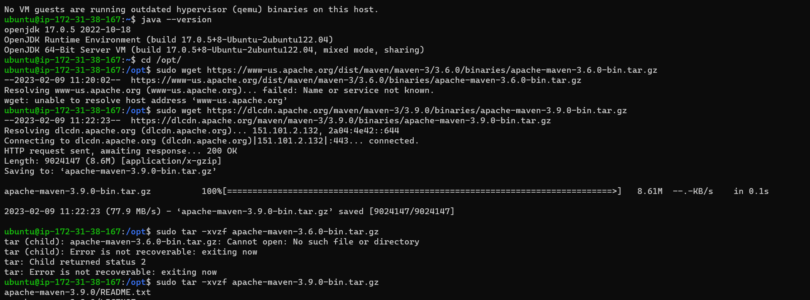
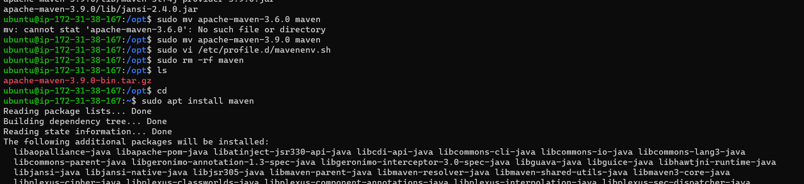
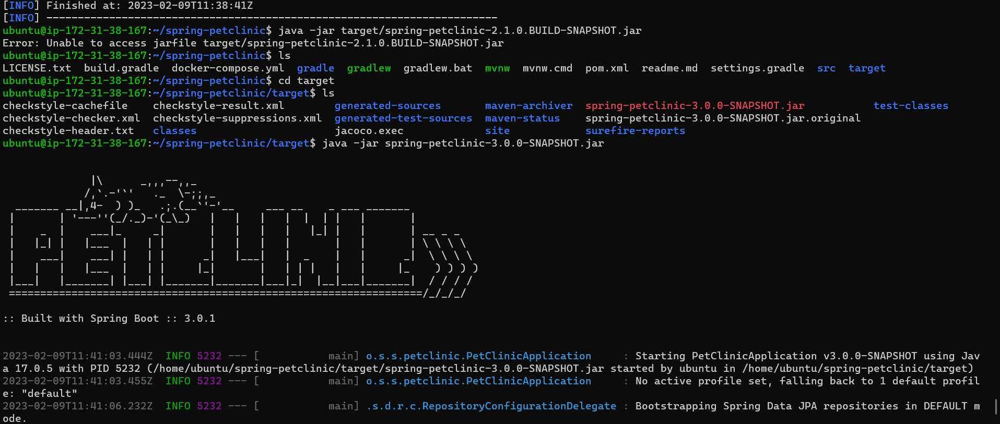
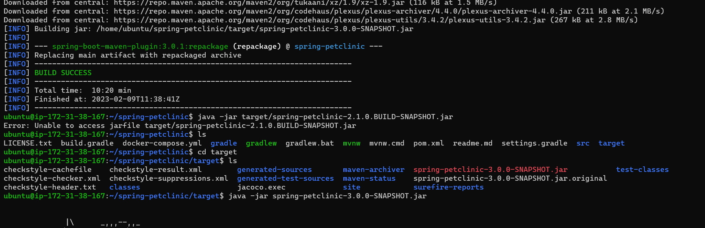

Write manual steps to build spring pet clinic.
----------------------------------------------

# Manual steps

To install Springpet clinic we need java and also maven for that please follow the below steps.
```
* sudo apt update
* sudo apt install openjdk-17-jdk -y
* java -version
```

```
* sudo apt install maven -y
* mvn --version
```

* git clone https://github.com/spring-guides/gs-maven.git
* cd gs-maven/initial
* mvn package
```

To see the springpetclic page in the web:
* cd Spring-petclinic
```

```
```
* cd target
* java -jar Spring-petclinic-3.0.0-SNAPSHOT.jar
```
```

Let's check springpetclinic on web:
http://ip-adress:8080


