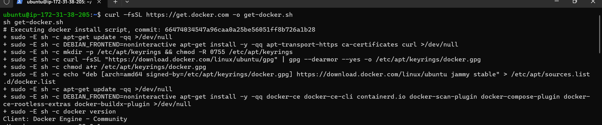
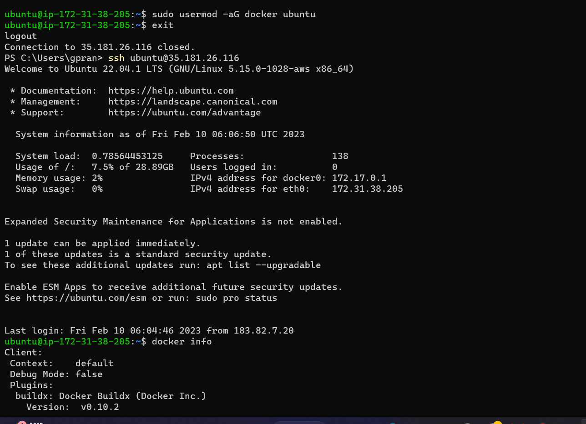
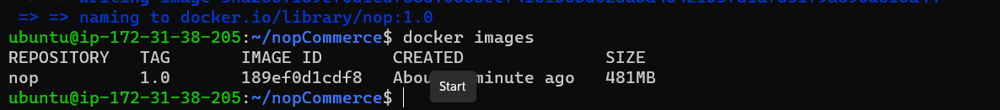

Hiw to build docker image for nopCommerce
----------------------------------------

## Manual steps
```
### Installation of docker
* curl -fsSL https://get.docker.com -o get-docker.sh
sh get-docker.sh
```

```
* sudo usermod -aG docker <username> {username is ubuntu}
 ``` 

 ```
* exit and relogin
* docker info [This command should not give any errors
```
```
Now clone gthe nopCommerce code from the git.
* git clone https://github.com/nopSolutions/nopCommerce.git
* cd nopCommerce/
* docker image build -t nop:1.0 .
* It will build the docker image
```



