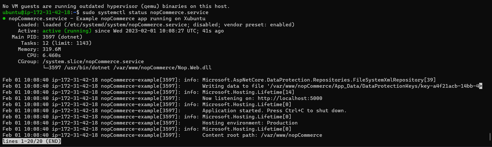

How to install nopCommerce on ubuntu
------------------------------------

*manual steps
```
wget https://packages.microsoft.com/config/ubuntu/20.04/packages-microsoft-prod.deb -O packages-microsoft-prod.deb
sudo dpkg -i packages-microsoft-prod.deb
sudo apt-get update
sudo apt-get install -y apt-transport-https aspnetcore-runtime-7.0
mkdir /var/www/nopCommerce
cd /var/www/nopCommerce
sudo wget https://github.com/nopSolutions/nopCommerce/releases/download/release-4.60.1/nopCommerce_4.60.1_NoSource_linux_x64.zip
sudo apt-get install unzip
sudo unzip nopCommerce_4.60.1_NoSource_linux_x64.zip
sudo mkdir bin
sudo mkdir logs
cd ..
sudo chgrp -R www-data nopCommerce/
sudo chown -R www-data nopCommerce/
sudo vi  /etc/systemd/system/nopCommerce.service
```
 Service file:
 ```
 [Unit]
Description=Example nopCommerce app running on Xubuntu

[Service]
WorkingDirectory=/var/www/nopCommerce
ExecStart=/usr/bin/dotnet /var/www/nopCommerce/Nop.Web.dll
Restart=always
#### Restart service after 10 seconds if the dotnet service crashes:
RestartSec=10
KillSignal=SIGINT
SyslogIdentifier=nopCommerce-example
User=www-data
Environment=ASPNETCORE_ENVIRONMENT=Production
Environment=DOTNET_PRINT_TELEMETRY_MESSAGE=false

[Install]
WantedBy=multi-user.target
```
```
sudo systemctl start nopCommerce.service
sudo systemctl status nopCommerce.service
```



### Ansible playbook
```
 First we have to install the package for that we will ust get_url module to download the file and the install the file.
 ```
 We have to install the dotnet.

 - name: install apt transport
   apt:
     name: 
        - apt-transport-https
        - aspnetcore-runtime-7.0
  Create one directory = module: File.
  Then download the file= module: get_url
  Unzip the downloaded file =module: Unarchive
  Create directories= module: file
  Then change the user and group chown chgrp= module:file
  After that create one service file with the below content.
   ```
   [Unit]
Description=Example nopCommerce app running on Xubuntu

[Service]
WorkingDirectory=/var/www/nopCommerce
ExecStart=/usr/bin/dotnet /var/www/nopCommerce/Nop.Web.dll
Restart=always
# Restart service after 10 seconds if the dotnet service crashes:
RestartSec=10
KillSignal=SIGINT
SyslogIdentifier=nopCommerce-example
User=www-data
Environment=ASPNETCORE_ENVIRONMENT=Production
Environment=DOTNET_PRINT_TELEMETRY_MESSAGE=false

[Install]
WantedBy=multi-user.target
```
Then restart the system and check the service.

